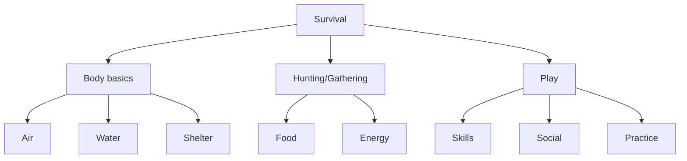
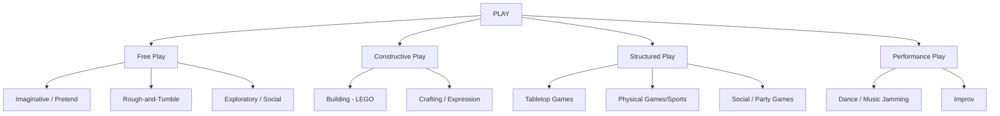

# Beginners' Introduction To Video Game System Design

A friendly introduction to understanding the fundamental concepts of Video Game System Design. This guide is designed for beginners.

> [!IMPORTANT]
> Information have been collected from multiple sources(Internet,books,own experience) and AI has been used to create a well-structured presentation.

---

## 📑 Table of Contents
* [The Human Survival Graph](#the-human-survival-graph)
* [What Is Play?](#what-is-play)
* [The Hierarchy of Play](#the-hierarchy-of-play)
* [Well-known academic definition of games](#well-known-definitions)
* [Problem with academic definition of games](#problem-with-definitions)
* [What Are Games?](#what-are-games)
* [What Are Video Games (2026)?](#what-are-video-games)

---

## The Human Survival Graph (Simplified)
> It all starts with us, because play has been with humans since the very beginning, right next to breathing, drinking, eating, and staying safe. While our bodies fought to survive, our minds used play to experiment, learn, and connect with others.

* **Body basics** 
The non-negotiable floor of staying alive minute-to-minute and day-to-day

* **Hunting/Gathering** 
The active, effortful acquisition of calories and resources (what actually keeps the body basics going long-term)

* **Play** 
looks “unnecessary” on the surface, but it secretly supports survival:
    - It trains skills before we need them in real life (like practice mode for danger).
    - It builds social bonds so groups can cooperate, trust each other, and share resources.
    - It lets us test ideas and strategies in a low-risk way, instead of gambling with real life.

Notice how **Play**  and **Hunting**  is parallel to each other. Hunting´s goal is to kill or survive (biological survival). 
But what about play?

## ✨ What Is Play?

Play is the broadest and most fundamental concept in this hierarchy. It is the soil from which games grow.

**Key Characteristics of Play:**
* **Voluntary:** No one can be forced to play; it is a choice.
* **Exploratory:** It involves testing boundaries and expressing creativity.
* **Artifical rules:** Rules are agreed upon at the begining.
* **Low Stakes:** It is not tied to immediate productivity or biological survival.

> **In short:** Play is voluntary, activity done for enjoyment, exploration, expression, or practice.

### 🏹 Play vs. Hunting
To understand Play, it helps to look at its opposite: **Hunting**

| Feature | Play (e.g., Wrestling for fun) | Hunting (e.g., Hunting for food) |
| :--- | :--- | :--- |
| **Motivation** | Joy / Practice | Hunger / Necessity |
| **Risk** | Safe / Controlled | High / Life-threatening |
| **Rules** | Self-imposed | Dictated by Nature |
| **Outcome** | Mostly Fair | Not fair |

---

## 🌳 The Hierarchy of Play

Below is just an example of how play can be categorized and how these concepts relate to one another, moving from unstructured freedom to highly structured systems. 

You might instantly connect video games to these categories. 
* **Free Play:** Minecraft,Roblox
* **Constructive Play:** Minecraft, The sims, 
* **Structured Play:** Mario kart, Among us, rocket league, fortnite.
* **Performance Play:** Just Dance,Comedy Night

A game can even fit in many different play categories. Which make it all very complex.

So what is a game then?

---

## Well-known academic definition of games

### Bernard Suits.
“Playing a game is the voluntary attempt to overcome unnecessary obstacles.”
* Rules create artificial obstacles.
* Players voluntarily accept them.
* The challenge itself is the point.

  
### Roger Caillois.
"Created the four categories of games: Competition,chance,role play and physical sensation."
* Free – voluntary
* Separate – occurs in a special time/place
* Uncertain – outcome unknown
* Unproductive – creates no wealth
* Rule-bound
* Fictional – involves make-believe

### Katie Salen & Eric Zimmerman.
"A game is a system in which players engage in artificial conflict, defined by rules, that results in a quantifiable outcome."
* System
* Players
* Artificial conflict
* Rules
* Quantifiable outcome

### Dax Gazaway.
* A game has agreed upon, artificial rules. 
* A player can have impact on the outcome of a game. 
* A Player can opt out of a game. 
* Game sessions are finite. 
* A Game has intrinsic rewards that hold no extrinsic value.

### Jesper Juul.
"A game is a rule-based system with variable and quantifiable outcomes where:"
* Rules define the game.
* Outcomes are variable and measurable.
* Players exert effort to influence outcomes.
* Outcomes are assigned value (win/lose).
* Players feel emotionally invested.

There are many more like Chris Crawford, Greg Costikyan, Sid Meier.

Notice that many definitions are the same, for example everyone agree upon that games have rules and players influence the outcome. 

---

## Problem with academic definition of games
Time moves on. Video games is a also a new concepts that sometimes breaks the old definition of a game.
For example older definitions struggled with the video game concepts like:
* persistent online worlds
* esports
* real-money economies
* sandbox games

---

## 🎲 What Are Games?

A game is a structured kind of play.

1. **🎯 Rules:** You can do some things and not others (in chess pieces move in certain ways, in football you cannot use your hands, etc.).

2. **🕹️ Agency:** Your decisions matter for what happens next (which card to play, where to move, how to aim).

3. **🏆 Goals:** Something you are trying to achieve (win, score points, reach the end, survive, solve a puzzle).

4. **🔔 Outcome:** Someone wins/loses, or you did better/worse, or you reached/didn’t reach the goal.

5. **✅ Voluntary Participation:** You’re doing it because you chose to, usually for fun, challenge, or social reasons.

---

## 🎲 What Are Video Games (2026)?

A video game is just a game that lives inside a computer, console, phone, etc.
Same core ideas as a game but with a specific wrapper.

### 📝 Core Components of a Video Game

1. **🎯 Rules:** Constraints that define how a player can interact with the system and pursue goals.

   - Players must perform actions (press buttons, move, interact) to progress.
   - Even open-ended games like **Minecraft** operate under rules that define interactions.

2. **🕹️ Agency:** Players have meaningful control over outcomes.

   - Pure luck alone does not create a game. For example, rolling a die and awarding the highest number offers no player influence.
   - If players can make choices that affect the outcome (e.g., multiple rolls, modifying dice, first to 21 by adding/subtracting), their decisions influence the result.

3. **🏆 Goals:** Clear objectives, progress states, or challenges.

   - Explicit goals: defeating enemies, completing levels, solving puzzles, reaching a score.
   - Progression goals: unlocking abilities, exploring worlds, improving characters.
   - Player-defined goals: sandbox games like **Minecraft** let players create their own objectives through building, exploration, or experimentation.

4. **🔔 Outcome:** The game responds to player actions.

   - Actions produce meaningful responses from the system.
   - Feedback can be **visual, audio, mechanical, or systemic** (animations, sounds, score updates, UI changes, world reactions).
   - Without feedback, players cannot understand the impact of their actions.

5. **✅ Voluntary Participation:** Players choose to engage.

   - Games are entered willingly by the player.
   - The player accepts rules and challenges in exchange for engagement or entertainment.
   - Even in competitive or professional play, participation is based on the player’s choice.
   - Players can technically opt out (e.g., closing the game), though some competitive games may impose penalties for leaving early.

---

### 🎮 Examples

| Example | Notes |
|--------|-------|
| ✅ Idle game with a button the player can press | Player can influence outcome. |
| ❌ Idle game that runs entirely by itself | No player input → simulation. |
| ❌ Movie | Viewer cannot influence outcome. |
| ✅ Detroit: Become Human | Story-driven, cinematic, player choices affect outcome. |
| ✅ The Last of Us Part I / II | Fixed cutscenes, but gameplay decisions influence progression. |

---

